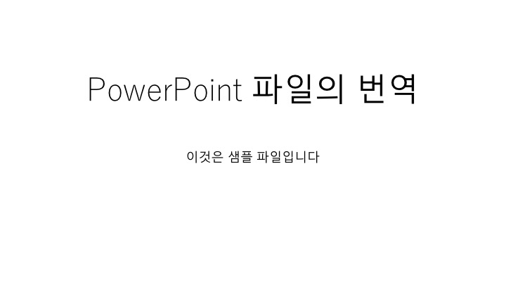
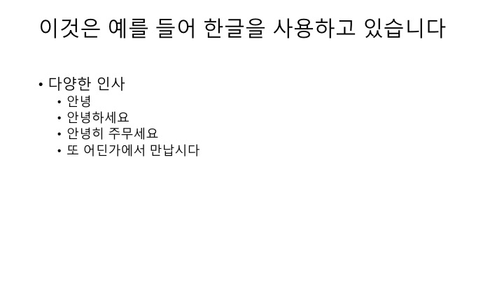
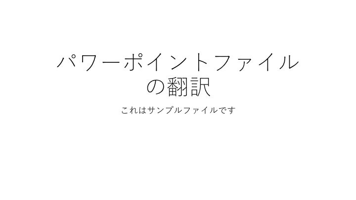
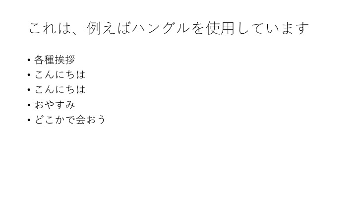

# ppt-tr

Translate text elements in a PowerPoint file ( `pptx` ).

Traverse objects in a PowerPoint file which has `pptx` extension, extract all (almost) text elements, translate using `Amazon Translate`, and output as a new file.

**NOTE:**
The `Presentation Translator` add-in is often more convenient.
https://www.microsoft.com/en-us/download/details.aspx?id=55024

## Prerequisites

* Installed [Leiningen](https://leiningen.org/).
* Your AWS account is set up ( **because this use `Amazon Translate` service** ).
* The AWS account profile is set up in your local.

## Usage

Just `lein run`.

In the default, a source file is `resources/test.pptx` and output as `resources/test.pptx.translated-at-{yyyyMMddHHMMss}.pptx`.
You can change it. It's written in the `-main` method directly.
Same in the source and target languages.

## TODO

* clean
* translate "Note" objects.
* lgging for processing time.
* ...

## Sample

from a input file

to a output file

## Reference

### reference for POI
* https://www.tutorialspoint.com/apache_poi_ppt/apache_poi_ppt_formatting_text.htm
* https://qiita.com/Lain_/items/6a1d3ed0255720d6d57a
* https://gist.github.com/ponkore/4216377
* https://poi.apache.org/apidocs/dev/org/apache/poi/xslf/usermodel/XSLFTextBox.html

### reference for Amazon Translate and Java SDK
* https://docs.aws.amazon.com/translate/latest/dg/examples-java.html
